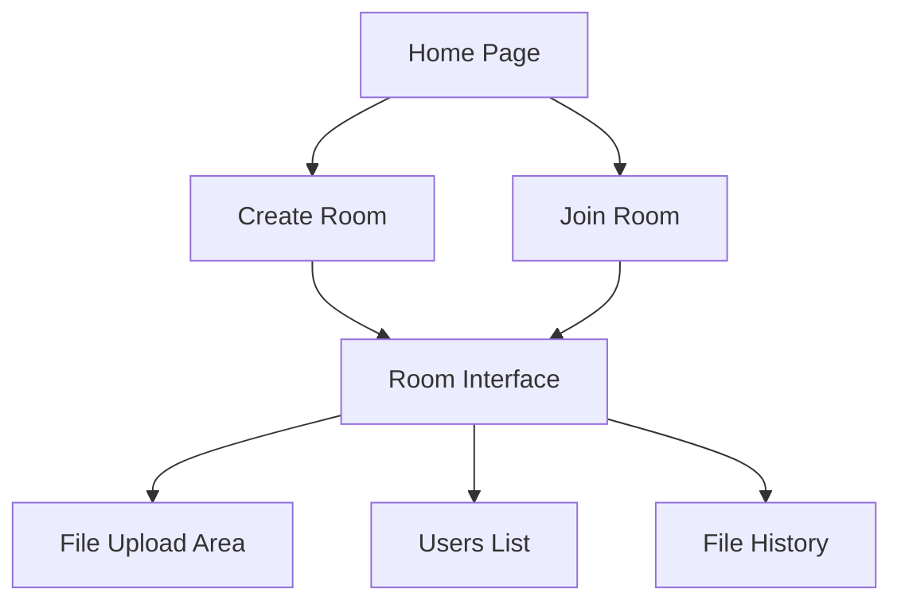
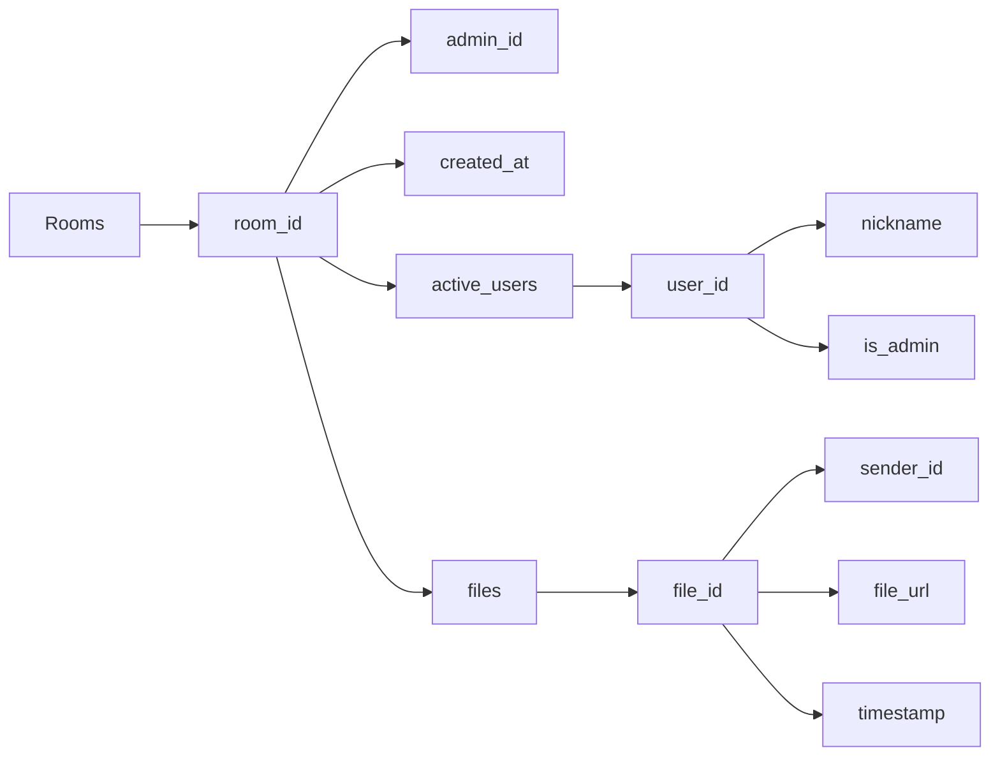
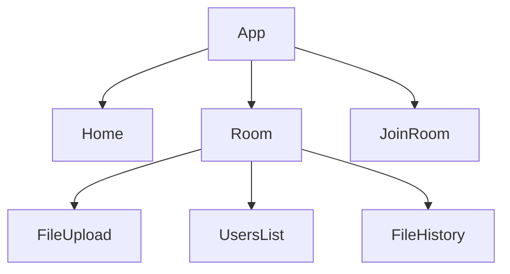
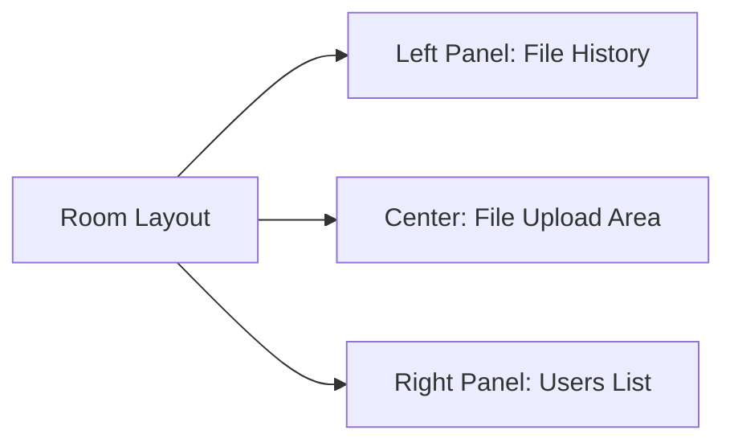

# FileSync Application - Project Plan

## Overview
FileSync is a real-time file sharing application that allows users to create temporary rooms for file sharing. Users can join rooms using unique 4-digit codes and share files in a chat-like interface.

## Architecture

### Data Flow

### Firebase Data Structure

### Component Structure

## Implementation Details

### 1. User Authentication System
- Temporary user system features:
  - Random userId generation
  - Nickname storage
  - Admin status management
  - Automatic cleanup on tab close
  - No persistent login required

### 2. Room Management

#### Room Creation
- Generate unique 4-digit room code
- Create room in Firebase with:
  - Room code as identifier
  - Creator marked as admin
  - Timestamp of creation
  - Empty files array
  - Active users list

#### Room Joining
- Room code validation
- Add user to active_users list
- Set up real-time listeners
- Display admin status for room creator

### 3. File Sharing System

#### Upload Features
- File upload to Firebase Storage
- Progress tracking
- File metadata storage
- Real-time updates to all room users

#### Download Features
- Secure URL generation
- Download progress tracking
- File accessibility management

### 4. UI Components

#### Home Page Layout
- Simple login form
  - Nickname input
  - User ID generation
- Action buttons
  - Create Room
  - Join Room
- Minimal branding

#### Room Interface Layout

#### Styling Guidelines
- Tailwind CSS implementation
- Color Scheme:
  - Primary: Red (#EF4444)
  - Secondary: White/Gray
  - Accent: Blue for interactive elements
- Responsive design
- Minimal yet attractive UI

### 5. Technical Stack

#### Frontend
- React 18+
- TypeScript
- Vite for build tooling
- Firebase SDK
- React Router v6
- File upload component

#### Backend (Firebase)
- Realtime Database
  - Room management
  - User tracking
  - File metadata
- Firebase Storage
  - File storage
  - Access control
- Security Rules
  - Room access restrictions
  - File size limits
  - User verification

## Implementation Phases

1. **Setup Phase**
   - Firebase configuration
   - Project structure setup
   - Base component creation

2. **Core Features**
   - User system implementation
   - Room creation/joining logic
   - Basic UI components

3. **File Handling**
   - Upload functionality
   - Download system
   - Progress tracking

4. **UI/UX Enhancement**
   - Styling implementation
   - Responsive design
   - Loading states
   - Error handling

5. **Testing & Optimization**
   - Performance testing
   - Error scenarios
   - Edge cases
   - UI/UX improvements

## Security Considerations

- Room access control
- File size limitations
- Temporary user validation
- Storage cleanup
- Room expiration logic